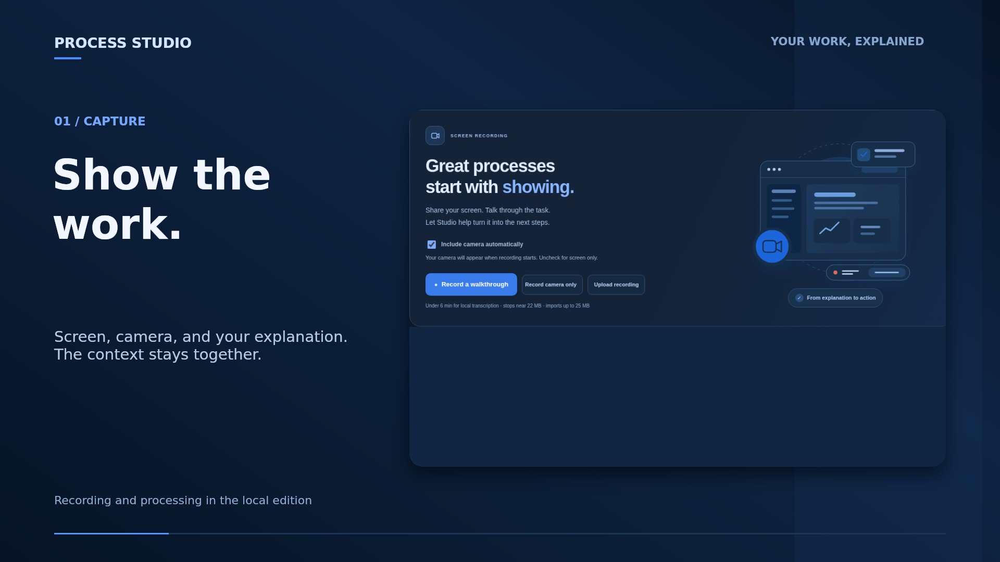

# Process Studio product film

70 seconds, 1920 × 1080, 24 fps. Real site captures, blue native motion graphics, original instrumental music, and on-screen storytelling. There is no spoken voiceover. The process shown is the clearly labelled built-in prepared example, not a live recording or live AI run. No private recordings or author accounts were used.

[Movie, complete editable native project and source screenshots](https://github.com/gideonallred-478/process-studio/releases/tag/v0.2.3-blue-themes-and-film). The editable project includes its imported media, original score and portable edit.mjs; the MP4 uses H.264/AAC.

[Watch the hosted movie](https://d2ol7oe51mr4n9.cloudfront.net/user_3J3UApXZGqJW0zEhxSv3OTYNwcO/65c2228d-6dbb-4d21-81f3-a8406015a2d6.mp4).

